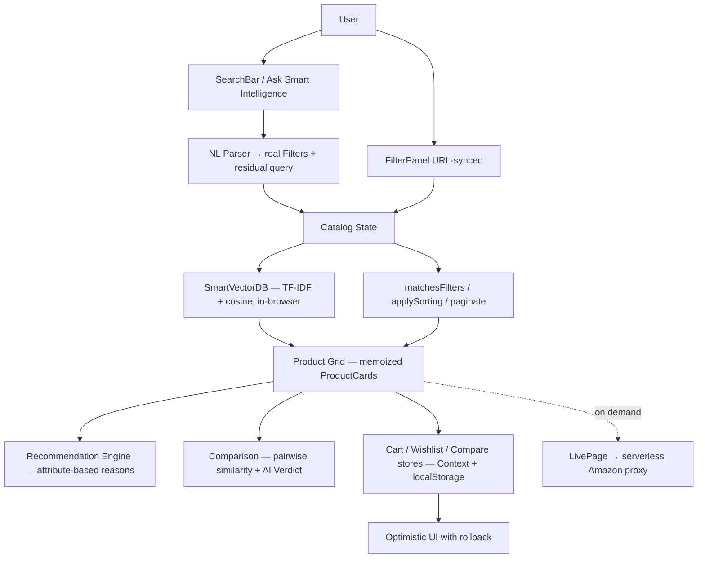

# 🧠 Smart Intelligence — AI Product Discovery & Intelligent Shopping Platform

A production-grade **React + TypeScript** commerce discovery app that runs a real **TF-IDF vector database with cosine similarity entirely in the browser** — natural-language search, explainable recommendations, and an AI comparison verdict with zero black-box APIs.

**🔴 Live:** https://smart-intelligence-himanshu90909s-projects.vercel.app

---

## ✨ Feature Highlights

| Area | What it does |
| --- | --- |
| **Vector search** | TF-IDF embeddings over the full 300-product catalog, cosine ranking, matched-term explanations, debounced suggestions with full keyboard navigation (`↑ ↓ Enter Esc`) and recent-search history |
| **Ask Smart Intelligence** | Natural-language queries — *"white running shoes under ₹3000"* — parsed into **real, visible filters** (category, brand, color, material, price, rating) with an interpretation panel. If a facet matches nothing in the catalog, it degrades honestly to vector ranking instead of showing a fake result |
| **Smart filtering** | Category, brand, min/max price, rating, discount %, color, material, availability — all multi-select, all synchronized with URL query params (shareable filter URLs) |
| **Honest recommendations** | Trending / Best Value / Highly Rated / Similar / Recently Viewed rails, each shipping a reason built from real product attributes |
| **AI comparison** | 2–4 products → winner per row + **AI Verdict** (Best Overall / Best Value / Best Rated / Best Budget) with data-driven "Why?" — never invents missing specs |
| **Optimistic cart** | Instant UI response, count updates immediately, persistence failure **rolls back state** and surfaces a toast |
| **Quick View** | Accessible modal (focus trap, Esc) — preview, quantity, add to cart, wishlist, compare without leaving the grid |
| **Live Amazon data** | `/live` pulls real products from the Real-Time Amazon Data API through a serverless proxy — the API key never reaches the client |
| **Engineering dashboard** | `/engineering` — live-measured metrics: vector build time, search latency, filter throughput, Web Vitals (LCP/CLS/long tasks) and actual downloaded bundle sizes |

## 🏗️ Architecture



```
src/
├── data/          products.ts, products.json (300-item catalog)
├── lib/           vectorDb.ts (TF-IDF engine) · nlQuery.ts (NL parser + honest fallback)
│                  filters.ts · facets.ts · recommend.ts · verdict.ts
│                  metrics.ts (live measurements) · format.ts · amazon.ts
├── store/         cart.tsx (optimistic + rollback) · appStore.tsx · toast.tsx · cartConstants.ts
├── components/    ui/ (primitives, Modal, Drawer) · product/ (ProductCard, QuickView,
│                  FilterPanel, Toolbar) · search/ · layout/ · cart/ · compare/
├── pages/         Home · Catalog · Product · Compare · Live · Engineering
└── hooks/         useDebounce.ts
functions/
└── amazonLive.ts  serverless proxy (search + product details by ASIN, CORS, key server-side)
```

### Search architecture
1. Input debounced 200 ms → instant suggestions from the vector DB
2. Submit → `?q=` written to the URL (shareable, restorable)
3. `parseNL()` extracts **hard filters** (price, rating, brand, category) and a residual keyword query
4. `SmartVectorDB.search()` ranks with cosine similarity through the filter predicate
5. Facets that match nothing degrade to query terms — the UI says so explicitly. **No invented products.**

### Recommendation logic
Strictly attribute-based: every rail computes from real price/rating/review/category/tag data and emits a human-readable reason ("4.6★ rated, 34% off, matches your viewed running shoes"). Deterministic and unit-tested.

### State management
Lightweight React Context + localStorage (cart, wishlist, compare, recently-viewed, search history). No Redux — the app's state is small, client-only, and persistence needs are simple; the trade-off is documented in interviews.

## ⚡ Performance (measured, not claimed)

Lighthouse on a production build (local preview, headless Chromium):

| Metric | Result |
| --- | --- |
| Performance | **99 / 100** |
| Accessibility | **100 / 100** |
| Best Practices | 96 / 100 |
| SEO | **100 / 100** |
| LCP / FCP | 1.7 s / 1.7 s |
| Total Blocking Time | 50 ms |
| Cumulative Layout Shift | 0.016 |

How it gets there:
- Route-level code splitting (Catalog 22 KB, Product 5.5 KB, Compare 6.7 KB, Live 7.3 KB gzipped ~2–7 KB each)
- Memoized `ProductCard` — flipping cart/compare state doesn't re-render 300 cards
- Facet counts and NL parses memoized per data set; filtering runs once per URL change
- Lazy images with fixed dimensions (CLS 0.016); skeleton loaders, no blank UI
- Debounced search; 250 ms simulated network latency keeps loading states honest
- Pagination bounds DOM size — no virtualization needed at 300 items (trade-off documented)

Live numbers re-measured on every visit at **/engineering**.

## 🧪 Testing

```bash
npm test              # 35 Vitest unit tests — vector engine, NL parser, facets,
                      # filters, recommendations, verdict, formatters, cart bounds
npx playwright test   # 4 E2E flows (production build via vite preview)
npm run build         # tsc -b strict + vite build
```

E2E flows test real user behavior:
1. Catalog → search "running shoes" → price filter → results respect the cap
2. Product → add to cart → cart drawer shows the product
3. Two products → compare → table + AI Verdict render
4. NL search "white shoes under ₹3000" → interpreted filters shown → price cap enforced

## ♿ Accessibility

- Semantic HTML, heading hierarchy, ARIA only where necessary
- Full keyboard shopping: combobox search with `aria-expanded`/`role=listbox`, focus-trapped modal and drawers, visible focus states
- Accessible names contain visible text (axe-clean); WCAG-AA palette (verified by Lighthouse 100/100)

## 🚀 Deployment

- **Frontend:** Vercel — Vite SPA with `vercel.json` rewrites for deep links
- **Live-data proxy:** serverless function keeps `RAPIDAPI_KEY` server-side

## 🔭 Future Improvements

- Sync cart/wishlist to a backend for cross-device persistence
- Virtualized grid if the catalog grows past a few thousand items
- Worker-side vector search for >1k products (keeps the main thread free)
- i18n and INR/USD currency switching

## 📄 License

MIT
